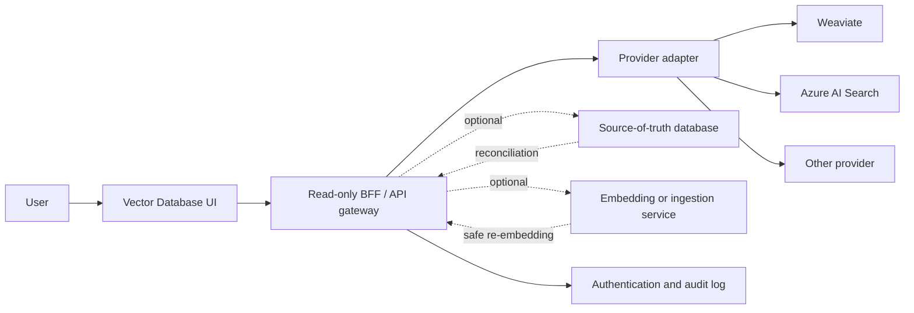

# Vector Database UI — Product and Technical Blueprint

## 1. Purpose

This document describes a standalone project whose only responsibility is to make a vector database understandable and operable through a user interface.

The project is derived from the **Vector Database** administration view in Consultant AI, but it is designed so that it can be reused with a different domain, ingestion pipeline, and vector provider. It does not include document upload, ingestion orchestration, RAG chat, knowledge extraction, or task creation.

The new product should answer these questions:

1. Is the vector database connected and healthy?
2. What collections, indexes, namespaces, or tenants exist?
3. What records and metadata are stored?
4. Which source produced a record, and when?
5. Does similarity retrieval return the expected records?
6. Are there missing, stale, duplicated, or orphaned records?
7. If administration is enabled, how can an operator repair data safely?

The recommended first release is a **read-only viewer plus a retrieval test lab**. Mutating operations should be introduced only after ownership and re-embedding rules are defined.

---

## 2. Product Boundary

### In scope

- Connect to a supported vector database through a provider adapter.
- Browse collections, indexes, namespaces, tenants, and vector records.
- Inspect text, metadata, provenance, and optionally vector statistics.
- Filter, sort, search, paginate, and export permitted data.
- Execute test similarity searches and explain the returned results.
- Display provider health, schema, capacity, and operational diagnostics.
- Compare a vector database with an optional source-of-truth system.
- Support permission-gated repair operations in later phases.

### Out of scope

- Uploading and parsing source documents.
- Chunking or embedding full documents as an ingestion workflow.
- End-user RAG chat.
- Prompt management or LLM agent orchestration.
- Replacing the provider's own infrastructure console.
- Training or evaluating embedding models.

The UI may offer a **re-embed one record** repair action later, but it should call an external embedding/ingestion service. The viewer itself should not become another ingestion pipeline.

### Important deployment distinction

A visual prototype can run entirely in the browser with mock data. A real UI must not connect from the browser directly to Weaviate, Azure AI Search, or another provider using privileged credentials. Real access requires a small backend-for-frontend (BFF) or API gateway that:

- stores provider credentials on the server;
- enforces user, collection, and tenant permissions;
- normalizes differences between providers;
- limits expensive searches and exports;
- records administrative activity in an audit log.

---

## 3. Bigger Picture



The UI sees one normalized model even when providers use different words and APIs. Provider-specific details remain available in an advanced panel, but ordinary screens use common concepts.

### Core relationship

```text
Connection
└── Collection / Index
    └── Namespace / Tenant (optional)
        └── Vector Record
            ├── Record ID
            ├── Embedding vector
            ├── Searchable content
            ├── Metadata
            └── Source provenance
```

---

## 4. Provider-Neutral Vocabulary

| UI term | Weaviate | Azure AI Search | Other common terms |
|---|---|---|---|
| Connection | Weaviate instance | Search service | Cluster, database, endpoint |
| Collection | Collection/class | Search index | Index, table |
| Scope | Tenant | Filtered project/index scope | Namespace, partition |
| Vector record | Object | Search document | Point, row, item |
| Metadata | Properties | Fields | Payload, attributes |
| Vector | Vector | Vector field | Embedding |
| Similarity method | Distance | Similarity algorithm | Cosine, dot product, Euclidean |

The provider adapter should expose optional capabilities rather than pretending that every provider supports the same operations.

Example capability flags:

- `supportsNamespaces`
- `supportsFullTextSearch`
- `supportsHybridSearch`
- `supportsVectorReadback`
- `supportsServerSideSort`
- `supportsRecordMutation`
- `supportsSchemaInspection`
- `supportsProviderMetrics`

The UI hides or disables unsupported controls and explains why.

---

## 5. Intended Users and Permissions

### Viewer

Needs to understand stored data and test retrieval. Can view approved collections, records, metadata, and query results. Cannot change data or expose secret connection configuration.

### Engineer or RAG developer

Needs retrieval diagnostics, raw request/response inspection, filters, latency, score comparisons, schema details, and embedding model information.

### Data operator

Needs data-quality checks, reconciliation, exports, repair jobs, and operational history.

### Administrator

Manages connections, secret references, access policies, destructive-operation permissions, and retention settings.

Recommended permission scopes:

| Permission | Allows |
|---|---|
| `vector.read` | Overview, records, details, metadata |
| `vector.query` | Similarity and hybrid test queries |
| `vector.export` | Download permitted records or metadata |
| `vector.reconcile` | Run comparisons and dry runs |
| `vector.manage` | Re-embed, update, or delete records |
| `connection.manage` | Configure provider connections and credentials |
| `audit.read` | View operation and security history |

---

## 6. Recommended Information Architecture

```text
Connections
└── Selected connection
    ├── Overview
    ├── Records
    │   └── Record details
    ├── Retrieval Lab
    ├── Data Quality
    ├── Schema & Index
    ├── Operations & Audit
    └── Settings
```

### Global layout

- Left navigation for connections and product sections.
- Top context bar for connection, collection/index, and namespace/tenant.
- Main content area for the selected screen.
- Persistent health indicator and last-refresh time.
- Permission-aware action menu.
- Shareable URLs containing the selected scope and non-sensitive filters.

The selected connection and scope must always be visible. This prevents a user from querying or deleting data in the wrong tenant.

---

## 7. Screen and Feature Requirements

### 7.1 Connections

Purpose: choose the vector database without exposing its secrets.

Features:

- List configured connections with provider, environment, region, and status.
- Search and filter connections.
- Show `Healthy`, `Degraded`, `Unavailable`, or `Unknown` status.
- Test a connection and display a safe error message.
- Show the last successful health check and measured latency.
- Add or edit a connection only for `connection.manage` users.
- Store a secret reference, never the raw secret in browser storage or returned API data.
- Clearly label production connections and require an extra confirmation for later administrative actions.

Suggested connection fields:

- display name;
- provider type;
- endpoint or server-side endpoint reference;
- environment;
- region;
- authentication method;
- server-side secret reference;
- default collection/index;
- TLS verification setting;
- read-only or administration-enabled mode.

### 7.2 Overview Dashboard

Purpose: communicate the state and shape of the selected scope at a glance.

Minimum cards:

- provider and connection status;
- collection/index name;
- namespace/tenant when applicable;
- total record count;
- filtered record count when filters are active;
- vector dimensions when discoverable;
- distance/similarity metric;
- embedding model and version when recorded;
- last ingestion or update time when recorded;
- query latency and error status.

Useful charts for a later release:

- record-count growth over time;
- records grouped by a selected metadata field;
- content-length distribution;
- records by document, source, or version;
- provider query latency and error-rate trend;
- data-quality issue counts.

Every metric must show its source and refresh time. Counts that are estimated or sampled must be labelled as such.

### 7.3 Records Browser

Purpose: inspect large numbers of vector records without loading full embeddings into the browser.

Default columns:

- record/chunk ID;
- source ID or document ID;
- source/document name;
- source version;
- chunk index;
- page or location;
- content preview;
- metadata summary;
- created/updated time when available;
- status or quality warning;
- actions allowed for the current user.

Required behavior:

- Server-side pagination; cursor pagination is preferred for large datasets.
- Configurable page size with an enforced maximum.
- Server-side sorting where the provider supports it.
- Search by exact record ID.
- Keyword search over content when supported.
- Dynamic metadata filters rather than domain-specific document filters only.
- Multi-select filters and numeric/date ranges.
- Apply and Clear actions for expensive filters.
- Selected-filter chips and a visible result count.
- Column selection, resizing, and sensible saved views.
- Loading, empty, unavailable, permission-denied, and partial-result states.
- Cancel or ignore stale requests when filters change quickly.
- Virtualized rows if a page can contain many records.
- Row click opens details without losing the current filter and page state.

Do not fetch raw vectors for the table. A single vector can contain thousands of numbers and adds cost without improving the browsing experience.

### 7.4 Record Details

Purpose: explain exactly what a record contains and where it came from.

Use a full page or wide drawer with these sections:

#### Identity and provenance

- record ID;
- collection/index and namespace/tenant;
- source/document ID and name;
- document/version ID;
- chunk index and page/location;
- ingestion run or job ID;
- chunking strategy/version;
- embedding model/version;
- created, embedded, and updated timestamps.

#### Content

- full stored text with preserved formatting;
- content length and token count if available;
- copy action;
- optional link back to the source system;
- optional highlight of terms matched by a keyword or hybrid query.

#### Metadata

- friendly key/value table;
- raw JSON view;
- nested object expansion;
- copy and permitted download actions;
- explicit display of missing or malformed required fields.

#### Vector information

- dimensions;
- data type;
- norm and basic statistics if available;
- vector-field name;
- similarity metric;
- optional, permission-gated raw vector view or download;
- warning when a provider cannot return stored vector coordinates.

#### Nearest neighbors

- retrieve similar records using this record as the query vector;
- show rank, score/distance, source, and content preview;
- allow metadata filters;
- explain whether a higher or lower score is better for the selected provider.

#### Quality and consistency

- source exists;
- provider record exists;
- expected dimension matches;
- content is not empty;
- metadata is valid;
- embedding model matches the current expected model;
- content checksum matches the embedded-content checksum when available.

### 7.5 Retrieval Lab

Purpose: test the capability that matters to a RAG system—whether a user query retrieves useful context.

Inputs:

- query text;
- optional raw vector input for engineering use;
- search mode: vector, keyword, or hybrid when supported;
- top-K result count;
- collection/index and namespace/tenant;
- metadata filters;
- similarity threshold;
- hybrid weighting or alpha when supported;
- optional embedding model selection if the gateway supports multiple compatible models.

Results:

- rank;
- normalized relevance indicator plus the provider's raw score/distance;
- record ID and source provenance;
- content preview with query-term highlighting where applicable;
- metadata;
- query latency;
- number of candidates or provider diagnostics when available.

Diagnostic features:

- expandable normalized request and response JSON;
- generated query-vector dimensions, not its full values by default;
- filter explanation;
- score semantics: cosine similarity, cosine distance, dot product, or Euclidean distance;
- clear distinction between keyword and vector contribution in hybrid mode;
- compare two queries or two search configurations side by side in a later release;
- copy a reproducible request with secrets removed.

The current Consultant AI Vector Admin search is a content/chunk-ID browser search. It is not a semantic retrieval test. The Retrieval Lab is therefore a new and essential feature for the standalone product.

### 7.6 Data Quality and Reconciliation

Purpose: reveal divergence between the vector provider and an optional authoritative source.

Checks should include:

- **Orphan vector:** exists in the provider but not in the source-of-truth database.
- **Missing vector:** exists in the source-of-truth database but not in the provider.
- **Duplicate identity:** multiple records represent the same source/chunk identity.
- **Dimension mismatch:** vector dimensions differ from the collection schema.
- **Empty content:** searchable content is absent or whitespace.
- **Invalid metadata:** required metadata is missing or has the wrong type.
- **Stale embedding:** content or embedding recipe changed after embedding.
- **Model mismatch:** records in one scope use unexpected model versions.
- **Dangling source:** source document or version no longer exists.

Workflow:

1. User selects the scope and checks to run.
2. System creates a scan job and shows progress.
3. Results are grouped by issue type and are exportable.
4. A dry run explains the proposed repairs.
5. An authorized user explicitly approves selected repairs.
6. The system records an audit entry and shows per-item success or failure.

Reconciliation is source-specific. If no authoritative system is configured, the UI should still run provider-only validations but must not claim that records are orphaned or missing.

### 7.7 Schema and Index Inspector

Purpose: make retrieval-relevant configuration visible without requiring provider-console access.

Show, when supported:

- vector fields and dimensions;
- searchable, filterable, sortable, retrievable, and key fields;
- metadata field types;
- similarity metric and vector-search algorithm;
- vectorizer configuration;
- analyzers used for keyword search;
- replicas, shards, partitions, and capacity;
- index/collection status;
- provider-specific raw schema in an advanced tab.

The first release should be read-only. Schema changes can be destructive and belong in a later, separately authorized administration product unless there is a strong use case.

### 7.8 Operations and Audit

Purpose: make slow scans and high-risk actions observable.

Show:

- operation ID and type;
- initiator;
- connection and scope;
- start/end time and duration;
- queued, running, succeeded, partially succeeded, failed, or cancelled status;
- processed/succeeded/failed counts;
- sanitized error summary;
- downloadable failure report when permitted;
- audit entries for connection tests, exports, reconciliation, re-embedding, updates, and deletes.

Long operations must be jobs rather than a browser request that remains open. Progress can use polling, Server-Sent Events, or WebSockets.

### 7.9 Settings

Settings can include:

- connection details and server-side secret references;
- default collection/index and namespace/tenant;
- display aliases for metadata fields;
- required metadata schema;
- sensitive fields that must be masked;
- result and export limits;
- embedding recipe expected for consistency checks;
- optional source-of-truth adapter;
- feature flags for export, reconciliation, and mutation;
- role assignments and audit retention.

---

## 8. Safe Administrative Features

These features are not recommended for the initial read-only release.

### Update content

Changing stored text without changing its embedding creates a corrupted semantic relationship: search uses the old vector while the UI displays new text.

A safe update must:

1. validate and normalize the new content;
2. use the same approved chunking/embedding recipe;
3. generate a new embedding;
4. validate its dimension;
5. update the authoritative record and provider according to a defined consistency strategy;
6. store the new content checksum, embedding model, and timestamps;
7. audit the before/after identifiers and hashes without logging sensitive full content;
8. expose partial failure and retry behavior.

If the embedding service is unavailable, editing must be disabled. The UI must never offer a text-only update that leaves the old vector in place.

### Delete record

The UI must make the deletion target explicit:

- provider record only;
- source/mirror record only;
- source and provider record;
- tombstone now and purge later.

The safest default is no delete capability. When enabled, require:

- `vector.manage` permission;
- exact scope and record identity in the confirmation;
- impact explanation, including whether ingestion can recreate the record;
- typed confirmation for bulk or production deletion;
- idempotency key;
- audit event;
- recoverable tombstone or backup when the provider supports it.

### Re-embed

Re-embedding should submit a job to the canonical embedding/ingestion service. It should not duplicate model configuration inside the UI gateway.

### Bulk actions

Bulk changes require selection limits, dry run, downloadable preview, job progress, per-record outcomes, cancellation when safe, and an audit trail.

---

## 9. Normalized API Contract

The exact route structure can change, but the UI should depend on a provider-neutral contract similar to this.

### Discovery and health

```http
GET /api/vector-connections
GET /api/vector-connections/{connectionId}/health
GET /api/vector-connections/{connectionId}/collections
GET /api/vector-connections/{connectionId}/collections/{collectionId}/scopes
```

### Overview and records

```http
GET /api/vector-connections/{connectionId}/collections/{collectionId}/overview?scope=...
GET /api/vector-connections/{connectionId}/collections/{collectionId}/records?scope=...&cursor=...&pageSize=...
GET /api/vector-connections/{connectionId}/collections/{collectionId}/records/{recordId}?scope=...
GET /api/vector-connections/{connectionId}/collections/{collectionId}/schema
```

Example list item:

```json
{
  "id": "chunk-guid",
  "scope": "project-42",
  "contentPreview": "A short preview...",
  "source": {
    "id": "document-17",
    "name": "requirements.pdf",
    "version": "3",
    "location": "page 8",
    "chunkIndex": 12
  },
  "metadataSummary": {
    "language": "en",
    "documentType": "requirements"
  },
  "vector": {
    "dimensions": 1536,
    "model": "configured-model-version"
  },
  "updatedAt": "2026-07-18T10:00:00Z",
  "qualityFlags": []
}
```

The API should return an opaque `nextCursor`. It should not expose a provider continuation token that contains secrets or internals unless it is signed and treated as opaque by the client.

### Retrieval

```http
POST /api/vector-connections/{connectionId}/collections/{collectionId}/query
```

```json
{
  "scope": "project-42",
  "mode": "vector",
  "text": "What are the delivery risks?",
  "topK": 10,
  "minimumScore": 0.65,
  "filters": {
    "documentType": ["requirements", "meeting-notes"]
  },
  "includeMetadata": true
}
```

The response should return provider score semantics so the client does not incorrectly assume that a larger value is always better.

### Data quality and jobs

```http
POST /api/vector-connections/{connectionId}/collections/{collectionId}/quality-scans
GET  /api/vector-operations/{operationId}
POST /api/vector-operations/{operationId}/repair
```

### Optional administration

```http
POST   /api/vector-connections/{connectionId}/collections/{collectionId}/records/{recordId}/reembed
DELETE /api/vector-connections/{connectionId}/collections/{collectionId}/records/{recordId}
```

Prefer explicit actions such as `reembed` to a generic content PATCH because the action communicates that text and vector must change together.

### Error model

Every endpoint should use a stable error shape:

```json
{
  "code": "PROVIDER_UNAVAILABLE",
  "message": "The selected vector connection is unavailable.",
  "correlationId": "...",
  "retryable": true,
  "details": []
}
```

Provider secrets, raw authentication failures, and unfiltered stack traces must not reach the browser.

---

## 10. Frontend State and Interaction Rules

Recommended state groups:

- **Route state:** connection, collection, scope, record ID, active screen.
- **Query state:** filters, sort, cursor, page size, retrieval configuration.
- **Server state:** health, overview, records, schema, query results, operations.
- **Local UI state:** open drawer, selected rows, column visibility, raw JSON expansion.
- **Session preferences:** theme, saved views, display density; no provider credentials.

Implementation rules:

- Put shareable non-sensitive state in the URL.
- Use a server-state/query library or equivalent cache with explicit invalidation.
- Abort obsolete requests and prevent older responses from replacing newer data.
- Keep the user's list position when opening and closing a record.
- Do not optimistically claim success for destructive actions.
- Refresh counts and details after completed repair operations.
- Display timestamps in the user's timezone while retaining UTC in API data.
- Preserve keyboard navigation, focus trapping in dialogs, screen-reader labels, and sufficient contrast.
- Support narrow screens, but optimize large record tables and the Retrieval Lab for desktop use.

---

## 11. Security and Privacy Requirements

- Authenticate every real API request.
- Authorize every connection, collection, scope, query, export, and mutation on the server.
- Never rely on a hidden button as authorization.
- Keep provider credentials and embedding API keys server-side.
- Encrypt secrets at rest and use TLS in transit.
- Enforce scope/tenant filters in the gateway; do not accept arbitrary provider filters from untrusted users.
- Allow metadata fields and content to be masked according to policy.
- Treat vectors as potentially sensitive; embeddings can reveal information about source data.
- Limit top-K, page size, query length, filter complexity, raw-vector access, and exports.
- Rate-limit expensive queries and scans.
- Protect cookie-authenticated mutations against CSRF.
- Sanitize displayed content and metadata to prevent script injection.
- Audit exports, connection changes, scans, repairs, updates, and deletions.
- Use correlation IDs without exposing secrets.

---

## 12. Performance and Scale Requirements

- Fetch only preview fields for record lists.
- Fetch full content, metadata, and optional vector values on demand.
- Prefer cursor pagination; offset pagination becomes expensive and unstable at scale.
- Push filters and sorting to the provider.
- Cache slow-changing schema and capability information briefly.
- Debounce lightweight searches or require Apply for expensive queries.
- Make exact total counts optional because some providers compute them expensively.
- Label estimated counts.
- Use background jobs for full-dataset scans, exports, and reconciliation.
- Cap and sample visualization data.
- Avoid requesting all record IDs merely to calculate a dashboard count.
- Record gateway and provider latency separately for diagnostics.

Suggested initial limits:

- page size: 25 by default, maximum 200;
- retrieval top-K: 10 by default, maximum 100;
- raw vector display: one record at a time;
- export: asynchronous above a configured threshold;
- visualization: sampled and explicitly labelled.

---

## 13. Optional Vector Visualization

A 2D or 3D cluster map can help users explore themes, outliers, and metadata groups, but it is not a literal view of high-dimensional space.

If included:

- sample the data and show the sample size;
- use PCA, UMAP, or t-SNE server-side or in a worker;
- allow coloring by metadata and filtering by scope;
- show a record preview on hover/click;
- explain that distances are distorted by dimensionality reduction;
- do not present clusters as proof of semantic quality;
- never load an entire large collection into the browser.

This is a Phase 3 feature, not a prerequisite for a useful vector database UI.

---

## 14. What to Reuse from Consultant AI

The existing implementation is a useful vertical slice and can provide UI patterns, DTO concepts, and provider-specific code.

### Reuse or generalize

| Current capability | Standalone treatment |
|---|---|
| Provider readiness and provider name | Reuse; add latency, last check, and richer status |
| Collection and tenant display | Generalize to connection, collection/index, and optional scope |
| Total and filtered counts | Reuse, but support estimated/unknown counts |
| Content and chunk-ID search | Reuse as record-browser search |
| Document multi-select | Generalize to dynamic metadata facets |
| Sort, direction, page size, and paging | Reuse; prefer cursor paging where possible |
| Record preview table | Reuse and make columns configurable |
| Detail modal with content and metadata | Reuse as a richer drawer/page |
| Read versus manage permissions | Reuse and expand into explicit scopes |
| Dry-run reconciliation | Reuse as the default repair workflow |
| Audit logging | Reuse for every sensitive operation |
| Request cancellation | Reuse to prevent stale UI updates |

### Add for the new product

- connection and collection discovery;
- semantic and hybrid Retrieval Lab;
- provider capability discovery;
- schema and vector-field inspection;
- vector dimensions, metric, model, checksums, and timestamps;
- dynamic metadata filtering;
- missing-vector detection in addition to orphan-vector detection;
- duplicate, dimension, metadata, and stale-embedding checks;
- long-running operation history;
- saved views and shareable URLs;
- optional sampled vector visualization.

### Do not copy without changing

1. **Text-only content editing.** Both current provider adapters update the stored content property and SQL mirror but do not regenerate the embedding. This can make semantic retrieval inconsistent with displayed text.
2. **Ambiguous deletion ownership.** The current delete removes the provider record and the `VectorEmbedding` mirror. A standalone system must define what is authoritative and whether an ingestion process can recreate the record.
3. **One-way reconciliation.** The current reconciliation finds provider records absent from the SQL mirror. It should also detect expected SQL/source records missing from the provider.
4. **SQL-backed details presented as provider state.** Current detail content comes from the SQL `VectorEmbedding` mirror. The new UI should label the data source and optionally compare mirror and provider values.
5. **Provider search presented as semantic search.** The current table search is content/ID search. Semantic retrieval needs a dedicated endpoint and score-aware results UI.
6. **Count-by-listing patterns.** Avoid listing all IDs merely to count or reconcile large collections; use provider aggregates or asynchronous scans where possible.

### Current implementation reference map

- Frontend view: [`FE/src/pages/Project/VectorAdmin.tsx`](../FE/src/pages/Project/VectorAdmin.tsx)
- Frontend API client: [`FE/src/lib/vectorAdminApi.ts`](../FE/src/lib/vectorAdminApi.ts)
- API controller: [`BE/src/ConsultantAPI/Controllers/VectorAdminController.cs`](../BE/src/ConsultantAPI/Controllers/VectorAdminController.cs)
- Service contract: [`BE/src/ConsultantAPI.Application/Interfaces/Services/IVectorAdminService.cs`](../BE/src/ConsultantAPI.Application/Interfaces/Services/IVectorAdminService.cs)
- Weaviate adapter: [`BE/src/ConsultantAPI.Infrastructure/Providers/VectorStore/WeaviateVectorAdminService.cs`](../BE/src/ConsultantAPI.Infrastructure/Providers/VectorStore/WeaviateVectorAdminService.cs)
- Azure AI Search adapter: [`BE/src/ConsultantAPI.Infrastructure/Providers/VectorStore/AzureAISearchVectorAdminService.cs`](../BE/src/ConsultantAPI.Infrastructure/Providers/VectorStore/AzureAISearchVectorAdminService.cs)

---

## 15. Delivery Plan

### Phase 0 — UI prototype

Goal: validate navigation and information density without provider access.

- Build the global shell and all read-only states.
- Use realistic mock connections, collections, records, and retrieval results.
- Include loading, empty, error, unavailable, and permission-denied examples.
- Validate table density, details layout, and Retrieval Lab usability.

### Phase 1 — Read-only MVP

Goal: safely inspect and query one real provider.

- Authentication and `vector.read`/`vector.query` permissions.
- One server-side provider adapter.
- Connections and scope selection.
- Overview dashboard.
- Records browser with server-side filters, sort, and pagination.
- Record details with content and metadata.
- Retrieval Lab with scores, latency, and raw sanitized diagnostics.
- Health and error handling.
- No edit, delete, schema mutation, or reconciliation apply.

### Phase 2 — Diagnostics

Goal: help engineers understand data quality and retrieval behavior.

- Second provider adapter.
- Schema/index inspector.
- Dynamic metadata facets.
- Nearest-neighbor record inspection.
- Provider-only data-quality checks.
- Optional source-of-truth adapter and two-way reconciliation dry run.
- Operation history and controlled export.

### Phase 3 — Controlled administration

Goal: repair known issues without creating silent inconsistency.

- Repair approval workflow.
- Re-embed through the canonical embedding/ingestion service.
- Explicit delete semantics and recoverability policy.
- Bulk operation jobs with dry runs and per-item results.
- Expanded RBAC and audit history.
- Optional sampled vector visualization.

---

## 16. MVP Acceptance Criteria

The read-only MVP is complete when:

1. A permitted user can select a connection, collection/index, and optional namespace/tenant.
2. The UI shows health, provider, scope, record count or an honest `unknown`, and refresh time.
3. The records table never fetches raw vectors by default.
4. Search, filters, sorting, and pagination are performed server-side and remain in the URL.
5. Opening a record shows full content, metadata, provenance, and available vector configuration.
6. Closing a record returns the user to the same table state.
7. The Retrieval Lab executes a semantic query, shows ranked results, raw provider score semantics, and latency.
8. Unsupported provider capabilities are hidden or clearly explained.
9. The browser never receives provider credentials.
10. Server authorization prevents access to an unpermitted connection or scope.
11. Loading, empty, provider-unavailable, timeout, permission, and malformed-data states are usable and testable.
12. The interface is keyboard accessible and usable at common desktop and tablet widths.
13. No mutation endpoint or button exists in the MVP.

---

## 17. Decisions Required Before Implementation

The following choices should be made explicitly for the new use case:

1. Which provider is implemented first?
2. Is the first deliverable a mock UI, a real read-only viewer, or both?
3. How are connections provisioned: configuration file, admin UI, or external secret manager?
4. What is the tenant/scope boundary that every query must enforce?
5. Which metadata fields are common, required, filterable, and sensitive?
6. Is there an authoritative source database for reconciliation?
7. Which service owns embedding generation and re-embedding?
8. Are raw vector coordinates allowed to be viewed or exported?
9. Are exact counts required, or are estimates acceptable?
10. What retention, audit, and production-deletion policies apply?

These are configuration and ownership decisions, not reasons to couple the UI to Consultant AI's project or document domain.

---

## 18. Recommended Starting Point

Create the new project around three deep modules:

1. **Provider gateway** — hides credentials and normalizes health, discovery, records, schema, and query operations.
2. **Explorer UI** — owns scope selection, overview, records, details, filters, and saved navigation state.
3. **Retrieval Lab** — owns semantic/hybrid query configuration and score-aware diagnostics.

Start with one provider and read-only capabilities. Keep source reconciliation and mutation behind optional interfaces so the same UI can be reused for a vector database that has no Consultant AI SQL mirror or document ingestion pipeline.

That boundary preserves the useful parts of the current Vector Admin while allowing the new project to serve a completely different domain.
